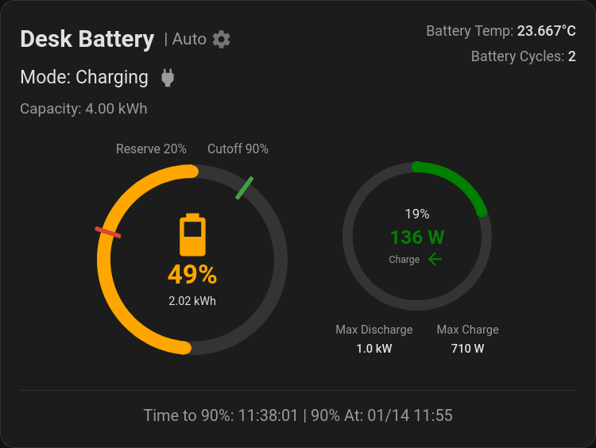

# Universal Battery Card

A generic Home Assistant Lovelace card for displaying battery information from **any** home battery system. Unlike vendor-specific cards, this card requires manual configuration of all sensors, making it compatible with any battery integration.



## Features

- **Circular Gauges**: SOC gauge with color-coded ring and optional power gauge
- **Responsive Sizing**: Automatically scales to fit Home Assistant's Sections view grid
- **Entity-Specific Clicks**: Click any element to open its entity's more-info dialog
- **Power Flow**: Real-time charge/discharge with directional fill (clockwise for charging, counter-clockwise for discharging)
- **Time Estimates**: Estimated time to full/empty and ETA
- **Stats Panel**: Optional temperature, cycle count, and health display
- **Reserve & Cutoff Markers**: Visual indicators on the SOC gauge
- **Color Thresholds**: 5 customizable SOC levels with individual colors
- **Fixed Values**: Use entities or fixed values for capacity, reserve, rates, and cutoff
- **Trickle Charge Filter**: Filter out small power fluctuations
- **Custom Icons**: Configurable icons for charging, discharging, and idle states
- **Header Styles**: Full, title-only, or no header options
- **Loading State**: Skeleton UI while waiting for entity data
- **Visual Editor**: Full point-and-click configuration UI

## Installation

### HACS (Recommended)

1. Open HACS in your Home Assistant instance
2. Click the three dots in the top right corner
3. Select "Custom repositories"
4. Add this repository URL with category "Dashboard"
5. Search for "Universal Battery Card" and install

### Manual Installation

1. Download `universal-battery-card.js` from the latest release
2. Copy to `config/www/universal-battery-card.js`
3. Add resource in Dashboard settings or via YAML:
   ```yaml
   resources:
     - url: /local/universal-battery-card.js
       type: module
   ```

## Configuration

### Required Entities

| Option | Description |
|--------|-------------|
| `soc_entity` | Sensor providing battery state of charge (%) |
| `power_entity` | Sensor providing battery power (W). Positive = charging, negative = discharging |

### Optional Entities

| Option | Description |
|--------|-------------|
| `state_entity` | Custom state text (overrides auto-detected Charging/Discharging/Idle) |
| `mode_entity` | Battery mode display (e.g., from input_select) |
| `soc_energy_entity` | Current battery energy in Wh/kWh |
| `capacity_entity` | Total battery capacity (or use fixed `capacity`) |
| `reserve_entity` | Battery reserve percentage (or use fixed `reserve`) |
| `charge_rate_entity` | Max charge rate (or use fixed `charge_rate`) |
| `discharge_rate_entity` | Max discharge rate (or use fixed `discharge_rate`) |
| `cutoff_entity` | Max charge cutoff percentage (or use fixed `cutoff`) |
| `temp_entity` | Battery temperature sensor |
| `cycles_entity` | Battery cycle count sensor |
| `health_entity` | Battery health percentage sensor |

### Fixed Values

Instead of entities, you can set fixed values:

| Option | Description |
|--------|-------------|
| `capacity` | Fixed capacity in kWh |
| `reserve` | Fixed reserve percentage |
| `charge_rate` | Fixed max charge rate in W |
| `discharge_rate` | Fixed max discharge rate in W |
| `cutoff` | Fixed max charge cutoff percentage |

### Display Options

| Option | Default | Description |
|--------|---------|-------------|
| `header_style` | `full` | Header display: `full`, `title`, or `none` |
| `show_runtime` | `true` | Show time estimates in footer |
| `show_rates` | `true` | Show power gauge (requires charge/discharge rates) |
| `gauge_thickness` | `15` | Ring thickness as percentage (5-15) |
| `decimal_places` | `3` | Decimal places for energy values |

### Example Configuration

```yaml
type: custom:universal-battery-card
name: Home Battery
soc_entity: sensor.battery_soc
power_entity: sensor.battery_power
soc_energy_entity: sensor.battery_soc_kwh
capacity: 5.2
reserve: 4
cutoff: 90
state_entity: sensor.battery_state
mode_entity: input_select.battery_mode
temp_entity: sensor.battery_temperature
cycles_entity: sensor.battery_cycles
```

### Minimal Configuration

```yaml
type: custom:universal-battery-card
name: Battery
soc_entity: sensor.battery_soc
power_entity: sensor.battery_power
```

### SOC Color Thresholds

```yaml
soc_threshold_very_high: 80
soc_threshold_high: 60
soc_threshold_medium: 40
soc_threshold_low: 20

# RGB colors (arrays)
soc_colour_very_high: [0, 128, 0]
soc_colour_high: [0, 128, 0]
soc_colour_medium: [255, 166, 0]
soc_colour_low: [219, 68, 55]
soc_colour_very_low: [139, 0, 0]
```

Note: "Very Low" color applies to any SOC below the "Low" threshold.

### Custom Icons

```yaml
icon_charging: mdi:lightning-bolt
icon_discharging: mdi:home-export-outline
icon_idle: mdi:sleep
```

### Trickle Charge Filter

```yaml
enable_trickle_charge_filter: true
trickle_charge_threshold: 25  # Watts
```

## Click Behavior

Clicking on card elements opens the more-info dialog for the associated entity:

| Element | Entity |
|---------|--------|
| SOC gauge | `soc_entity` |
| Power gauge | `power_entity` |
| Temperature stat | `temp_entity` |
| Cycles stat | `cycles_entity` |
| Health stat | `health_entity` |
| Mode/cog icon | `mode_entity` |
| State row | `state_entity` |

## Visual Editor

The card includes a full visual configuration editor. Click "Edit" on any card to access tabs for:

- **General**: Card name, decimal places, header style, display toggles, gauge thickness
- **Entities**: All sensor/entity pickers and fixed values
- **Stats**: Temperature, cycles, and health entities
- **SOC Colors**: Threshold percentages and colors
- **Icons**: Custom status icons
- **Filters**: Trickle charge settings

## Development

This card is a single vanilla JavaScript file with no build step required. It uses Home Assistant's built-in LitElement library.

To modify, simply edit `universal-battery-card.js` and copy to your Home Assistant installation.

## License

MIT - See [LICENSE](LICENSE) file.

## Credits

This project is based on [givtcp-battery-card](https://github.com/Codegnosis/givtcp-battery-card) by [Codegnosis](https://github.com/Codegnosis). The original card was designed specifically for GivTCP/GivEnergy systems - this fork removes the vendor-specific dependencies to work with any battery system.
